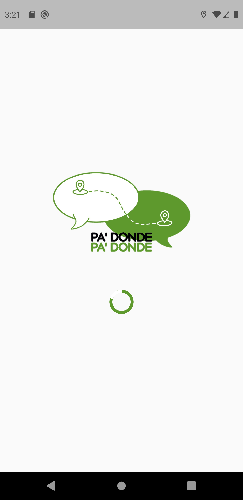

# README.MD

## INTRODUCCIÓN

Para poder ejecutar el aplicativo debe de tener presente los siguientes pasos.

## FLUTTER
El artefacto esta desarrollado bajo el framework de FLutter (Google). Para poder installar este sistema debe de acceder al siguiente link para seguir los pasos de instalación en el respectivo sistema operativo.


[Link documentación e instalación de Flutter (click aqui)](https://docs.flutter.dev/get-started/install)

Dependiendo el sistema operativo en su mayoria le descargara un archivo comprimido con todo el entorno para la ejecución del aplicativo. En el link anterior encontrara toda la información necesaria para la respectiva installación.

## - NOTA
Recuerde que debe de establecer en variables del entorno. Para que pueda reconocer los comandos propios del framework en la maquina.

## ANDROID
Para poder ejecutar un simulador de un dispositivo android debe de instalar
`Android Studio` en el siguiente link encontrará toda la información necesaria para instalar el software.

[Link documentación de descarga e instalación de Android Studio (click aqui)](https://developer.android.com/studio?hl=es-419&gclsrc=ds&gclsrc=ds&gclid=COmpopeutfQCFYo_Hwod76gBrA)

Para la instalación y ejecucción del simulador. Se recomienda leer las instrucciones que se encuentran en el siguiente link. En este mismo se encuentran los requisitos de la maquina local para su correcto funcionamiento.

[Link documentación de la ejecución del simulador (click aqui)](https://developer.android.com/studio?hl=es-419&gclsrc=ds&gclsrc=ds&gclid=COmpopeutfQCFYo_Hwod76gBrA)

## RECOMENDACIÓN
Se recomienda instalar el siguiente emulador: Pixel 3 XL


## EJECUCIÓN DEL PROGRAMA
Teniendo presente que ya tiene el entorno listo. Ya solamente queda la ejecución del artefacto para ello debe: 

   1. Clonar el repositorio o descargarlo en formato .zip
   2. Abrir el IDE. Puede abrirlo con `Android Studio` o `Visual Studio` (Se recomienda usar Visual Studio dado que tiene un mejor rendimiento).
   3. A partir de este paso se realizara se explicará para la ejecución en Visual Studio. Si decide usar Android Studio se recomienda leer la siguiente documentación [Ejecución de Flutter en Android Studio.](https://giancarlocode.com/tutoriales-de-flutter/como-instalar-flutter-en-windows-10-en-android-studio-y-visual-studio-code/)
   4. Abrir Visual Studio y arrastrar o abrir la carpeta del repositorio que descargo. Una vez hecho esto debe de poder visualizar la siguiente estructura.
 
 

  
  5. Es posible que la primera vez que intente ejecutar el programa le salga errores. Esto se debe a que debe de actualizar las dependencias que tiene el artefacto. Para ello debe de abrir la consola o terminal de Visual Studio y ejecutar el siguiente comando.

```bash
flutter pub get
```

  Este debe de solucionar los posibles errores. Una vez validado esto puede proceder a ejecutar el proyecto. Para ello debe dar clic en `Run>Start Without Debugging` en la ventana principal del IDE. o presionar Cttl+5.

## NOTA

  Debe de asegurarse de estar corriendo el emulador de Android y haberlo seleccionado en el IDE. En el siguiente link puede encontrar más información. [Link documentación de la ejecución de proyecto en flutter (click aqui)](https://esflutter.dev/docs/development/tools/vs-code) 

  Para que el proyecto funcione correctamente debe asegurarse que antes de ejecutar el proyecto de flutter, el backend debe de estar corriendo dado que el aplicativo tiene manejo de sesiones y apenas inicia valida con el backend si el usuario ya estaba logueado en el dispositivo o no y si no recibe respuesta del backend el aplicativo no pasara de la pantalla inicial.

## FUNCIONAMIENTO

 A continuación se da una imagen preliminar de como deberia de comenzar el programa.

  